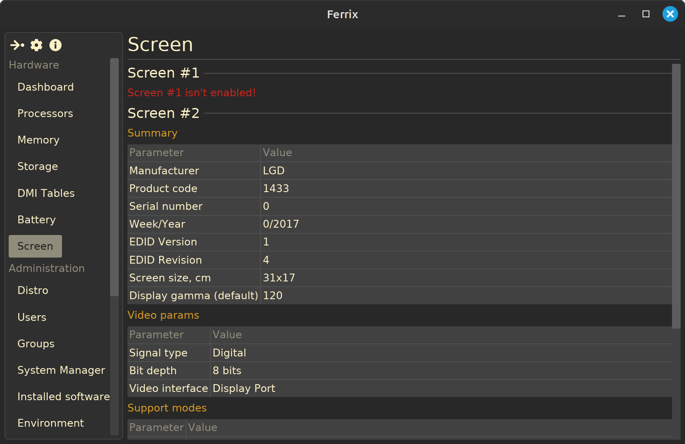

<div align="center">
  
  <h1>Ferrix — Swiss Knife for Linux Hardware Diagnostics</h1>
  <!-- <p><b>A simple program for getting information about computer hardware and installed software.</b></p> -->
  <!-- <h4> -->
    <!-- <a href="" -->
  <!-- </h4> -->
  <!--  -->

  [](https://www.gnu.org/licenses/gpl-3.0) [](https://www.rust-lang.org/) [](https://github.com/mskrasnov/ferrix/releases)
</div>

 

> **NOTE:** For now, this repository contains the [`ferrix-lib`](./ferrix-lib/README.md) crate, which provides an API for obtaining information about hardware and software. I've also started work on the [`ferrix-app`](./ferrix-app/README.md), a GUI for `ferrix-lib`, but I haven't finished it yet and I don't think I'll be able to finish it by the end of this year. It's all about serious Internet outages in the region where I live - without it, I won't be able to commit to this repository.

## What is Ferrix?

Ferrix is a Rust-crate and program for obtaining information about computer hardware and software. It is designed to work in modern Linux OS distributions.

## Functions (`ferrix-lib` crate)

1. Get information about:
    - [X] CPU;
    - [X] RAM;
    - [ ] Storage;
    - [X] BIOS and PC Motherboard;
    - [ ] Laptop battery;
    - [X] Installed Linux distribution;
    - [ ] Desktop environment;
    - [X] systemd services;
    - [ ] flatpak packages;
2. Convert collected data into:
    - [X] JSON;
    - [X] XML;
<!-- 3. Reset GNOME Desktop settings; -->

<!--## Installation

### Use Flatpak (recommend)

```bash
flatpak install flathub com.mskrasnov.Ferrix
```

### Use AppImage (for portable builds of Ferrix)

Download `*.AppImage` package (runs anywhere):

1. Grab the latest *stable* `*.AppImage` from [Releases](https://github.com/mskrasnov/Ferrix/releases);
2. Make it executable: `chmod +x Ferrix-*.AppImage`;
3. Run it: `./Ferrix-*.AppImage`-->

<!-- ## Screenshots -->

<!-- <details> -->
  <!-- <summary><b>Show</b></summary> -->

  <!-- <br> -->

<!-- **Dashboard** -->
<!--  -->

<!-- **OS info** -->
<!--  -->

<!-- **CPU info** -->
<!--  -->

<!-- **RAM info** -->
<!--  -->

<!-- **Information about system storage** -->
<!--  -->

<!-- **Motherboard info** -->
<!--  -->

<!-- **systemd services info** -->
<!--  -->

<!-- **GNOME settings reset page** -->
<!--  -->

<!-- **Dark mode** -->
<!--  -->

<!-- </details> -->

## Technology stack

- **OS:** Linux with `glibc` and `systemd`;
<!-- - **Desktop:** runs best on GNOME Shell 42+ (with `libadwaita`), but may work on other desktop shells; -->
<!-- - **Dependencies:** `glibc`, `flatpak` (optional), `systemd`, `dmidecode`, `gtk4`, `libadwaita`; -->
- **Programming language:** Rust 1.88+ (2024 edition);
<!-- - **GUI:** GTK4 + `libadwaita`; -->
- **Hardware:** modern PC or laptop;

## ❤️ Support Ferrix

Developing Ferrix takes time and passion. If you find it useful, please consider supporting its development:

- **Star ⭐ this repo!** It helps others discover Ferrix;
- **Write comments, questions, bug reports, or suggestions** for new functionality in [issues](https://github.com/mskrasnov/Ferrix/issues/new).
- If you are from Russia, **send me a donation 💰** to the card: `2202 2062 5233 5406` (Sberbank). This will help me keep my enthusiasm alive, as well as pay my mobile internet bills so that I can continue working on Ferrix.
- **Spread the world!** Tell friends, post on forums.

## License

Ferrix is free and open-source software distributed under the **GNU General Public License v3.0**. See [LICENSE](LICENSE) file for details.
