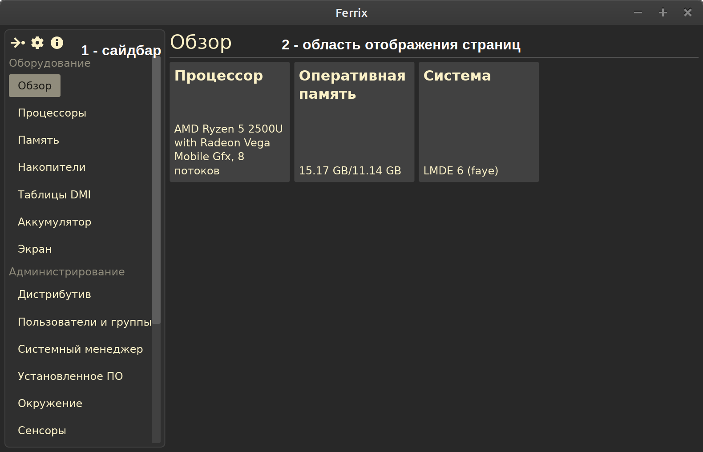

# Использование программы Ferrix

В данном разделе представлены сведения об использовании Ferrix после его установки на компьютер.

## Запуск программы

После установки найдите Ferrix в главном меню вашей системы и запустите его. Интерфейс программы разделён на три части:

1. Заголовок программы содержит главное меню (1.1), название текущей выбранной категории (1.2), а также контекстное меню с дополнительными действиями (1.3). Главное меню содержит кнопки "Экспортировать", открывающую диалоговое окно для экспорта данных в JSON/XML/`*.txt`, "Настройки", открывающую диалоговое окно с параметрами программы, "Поддержать разработку" и "О программе".
2. Сайдбар - содержит кнопки для выбора категории данных, которые необходимо отобразить.
3. Область отображения данных. Здесь данные представлены в следующих видах: набор пар `ключ: значение` для простых данных (не поддерживает сортировку), для более сложных значений отображение в табличном виде, где может присутствовать сортировка значений.

Теперь пришло время ознакомится с функциональностью нашей программы.

## Обзор функциональности

Обратите внимание, что функционал этой программы будет несколько различаться в зависимости от метода установки:

| Функция           | Ferrix Native | Ferrix AppImage | Ferrix Flatpak |
|------------------:|:-------------:|:---------------:|:--------------:|
| Обзор             | +             | +               | +              |
| Процессоры        | +             | +               | +              |
| Память            | +             | +               | +              |
| Накопители        | +             | +               | +              |
| Таблицы DMI       | +             | **-**           | **-**          |
| Видео             | +             | +               | +              |
| Аудио             | +             | +               | +              |
| Питание           | +             | +               | +              |
| Система           | +             | +               | +              |
| Администрирование | +             | +               | +              |
| Рабочий стол      | +             | +               | +              |

Здесь приведены следующие версии в зависимости от метода установки:

- **Ferrix Native** — «нативная» версия программы, установленная непосредственно в операционную систему из `deb`/`rpm` (для Debian, Ubuntu, Mint или для Altlinux, Fedora) пакета или из AUR (Archlinux);
- **Ferrix AppImage** — переносная версия программы, запущенная из файла `Ferrix-VERSION-x86_64.AppImage`, где `VERSION` — версия программы;
- **Ferrix Flatpak** — изолированная версия программы, установленная в систему с помощью Flatpak.

Как нетрудно заметить, в переносной (AppImage) и изолированной (Flatpak) версиях программы отсутствуют действия, для выполнения которых требуются права `root`. И если в переносной версии Ferrix этого не будет никогда, то в изолированной этот функционал скоро будет добавлен.

## Список функций

- **Обзор** — dash-панель с основными сведениями о компьютере: название, частота и число ядер процессора, объём и тип оперативной памяти, название и версия установленной операционной системы, свободное место в разделах `/` и `/home` (если последний существует), а также состояние аккумулятора ноутбука (если он есть).
- **Процессоры** — информация о каждом ядре/потоке процессора. Отображается в виде списка пар `ключ: значение` для каждого ядра/потока.
- **Память** — информация об оперативной памяти и подкачке. Страница разделена на две подстраницы: общая информация об ОЗУ и подкачке, а также более подробная информация по каждому файлу/разделу подкачки.
- **Накопители** — информация о разделах (сколько занято, сколько свободно, сколько всего, файловая система);
- **Таблицы DMI** — информация, прочитанная из следующих таблиц DMI:
    - Сведения о материнской плате;
    - BIOS компьютера;
    - Шасси/корпус;
    - Процессор;
    - Блоки памяти;
- **Видео** — информация о подключенных экранах (название, поддерживаемые разрешения, прочая информация, полученная в том числе и из данных EDID);
- **Звук** — [TODO];
- **Питание & аккумулятор** — сведения об аккумуляторе(ах) ноутбука (если есть);
- **Система** — информация об установленном дистрибутиве и ядре Linux;
- **Администрирование** — список пользователей и групп, информация о сервисах `systemd`, список установленного ПО (пока поддерживается только `deb` и flatpak);
- **Рабочий стол** — всякие разные функции, связанные с рабочим окружением GNOME Shell. На данный момент поддерживается только резервное копирование его настроек и их сброс при необходимости.
