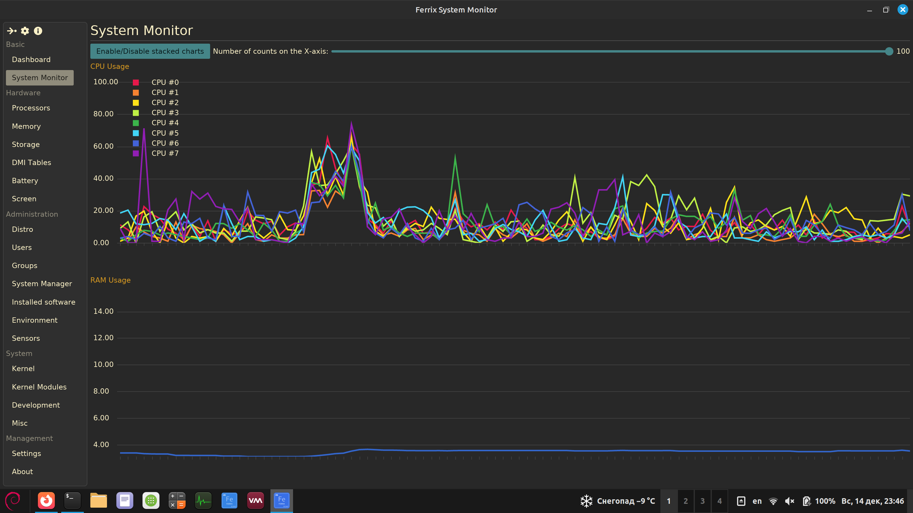

<div align="center">
  
  <h1>Ferrix System Monitor — Swiss Knife for Linux Hardware Diagnostics</h1>
  <p><b>A simple program for getting information about computer hardware and installed software.</b></p>
  
  

  [](https://www.gnu.org/licenses/gpl-3.0) [](https://www.rust-lang.org/) [](https://github.com/mskrasnov/ferrix/releases)
</div>

A lightweight, fast and modern system information tool for Linux, built with Rust and Iced.

## What is FSM?

Ferrix System Monitor is a Rust-crate and program for obtaining information about computer hardware and software. It is designed to work in modern Linux OS distributions.

## Motivation

For Linux, there are a bunch of different console programs for getting information about various PC and OS components. In addition, there is an amazing graphics program called Hardinfo (and its sequel, Hardinfo2). However, I wanted to write their simple analog with the following differences:

1. More complete support for modern Linux distributions: displaying information about systemd services, OS boot time, information about installed Flatpak packages, and the ability to reset GNOME environment settings (**NOTE:** I haven't implemented exactly these functions yet, but I plan to implement them in the future. They will be included in Ferrix v1.0);
2. I needed experience in developing a similar class of programs for Linux. Don't think that Ferrix is any kind of serious professional program — it's just a student's "DIY", nothing more. Use it at your own risk.

## Features

### System Overview

- **Dashboard** with key system metrics at a glance;
- **Real time monitoring** of CPU, memory and others PC's components;

### Hardware Information

- Processor details;
- Memory specifications;
- Notebook's battery;
- [TODO] Data from DMI tables;

### Software Information

- Installed system;
- Kernel information;
- Users and groups;
- `systemd` services;

### User Experience

- **Modern, clean interface** based on [iced](https://iced.rs);
- **Minimal dependencies** (`systemd`, `glibc`, `dbus`, `polkit`, `xdg`);
- **Fast startup** and low memory footprint.

## Installation

Download pre-built binaries from [GitHub Releases](https://github.com/mskrasnov/ferrix/releases/latest)

... or build Ferrix from sources:

```bash
git clone https://github.com/mskrasnov/ferrix
cd ferrix

make build
sudo make install

# Run `sudo make uninstall` to uninstall app
```

### Build dependencies

- **Rust** 2025;
- Modern Linux system with `systemd` and `d-bus` (tested on Debian 12.2);

## Technology stack

- **OS:** Linux with `glibc`, `dbus`, `polkit` and `systemd`;
- **Multilanguage:** English and Russian translations;
- **Programming lang.:** [Rust](https://rust-lang.org);
- **GUI:** [iced](https://iced.rs);

<a href="https://iced.rs">
  
</a>

## ❤️ Support Ferrix System Monitor

Developing Ferrix System Monitor takes time and passion. If you find it useful, please consider supporting its development:

- **Star ⭐ this repo!** It helps others discover Ferrix;
- **Write comments, questions, bug reports, or suggestions** for new functionality in [issues](https://github.com/mskrasnov/Ferrix/issues/new).
- If you are from Russia, **send me a donation 💰** in [Boosty](https://boosty.to/mskrasnov). This will help me keep my enthusiasm alive, as well as pay my mobile internet bills so that I can continue working on Ferrix.
- **Spread the world!** Tell friends, post on forums.
    
## License

Ferrix System Monitor (`ferrix-lib`, `ferrix-app`) is distributed under the [GNU GPLv3](../LICENSE) license.
