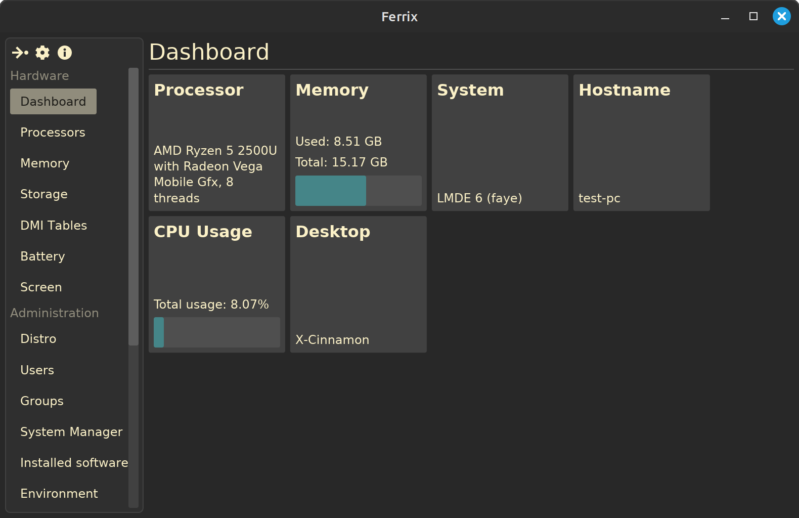

# Ferrix - Modern System Information Tool for Linux

A lightweight, fast and modern system information tool for Linux, built with Rust and Iced.



## Features

### System Overview

- **Dashboard** with key system metrics at a glance;
- **Real time monitoring** of CPU, memory and others PC's components;
- **System health scoring** based on multiple factors.

### Hardware Information

- Processor details;
- Memory specifications;
- Storage information;
- Battery status;
- Data from DMI tables;

### Software Information

- Installed system;
- Kernel information;
- Users and groups;
- `systemd` services;

### User Experience

- **Modern, clean interface** based on [iced](https://iced.rs);
- **Minimal dependencies** (`systemd`, `glibc`);
- **Fast startup** and low memory footprint.

## Installation

```bash
cargo install ferrix-app
```

... or download pre-built binaries from [GitHub Releases](https://github.com/mskrasnov/ferrix/releases/latest)

... or build Ferrix from sources:

```bash
git clone https://github.com/mskrasnov/ferrix
cd ferrix

cargo build --release
./target/release/ferrix-app
```

### Build dependencies

- **Rust** 2025;
- Modern Linux system with `systemd` and `d-bus` (tested on Debian 12.2);
